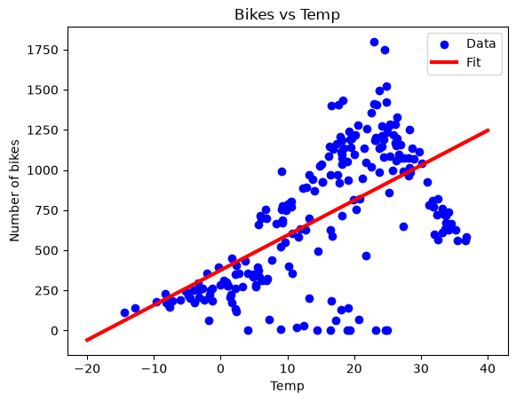
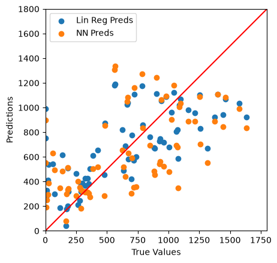

# Seoul Bike Sharing Demand — Regression Analysis

A Jupyter notebook that predicts how many bikes are rented at noon in Seoul from the day's weather, comparing linear regression (scikit-learn) with small neural networks (TensorFlow/Keras).

[](https://github.com/ShibilAhamed701212/bike-rental-regression-analysis/actions/workflows/ci.yml)

## Overview

The [Seoul Bike Sharing Demand dataset](https://archive.ics.uci.edu/dataset/560/seoul+bike+sharing+demand) (UCI Machine Learning Repository) records the hourly count of rented public bikes in Seoul from 1 Dec 2017 to 30 Nov 2018, with weather readings for each hour. The notebook keeps only the 12:00 record of each day (365 rows) and asks how well weather explains noon demand.

## Dataset

- **File:** `seoul+bike+sharing+demand/SeoulBikeData.csv` (8,760 hourly rows, 14 columns, Latin-1 encoded)
- **Original sources:** Seoul Open Data (data.seoul.go.kr) and South Korea public holidays (publicholidays.go.kr)
- **Target:** `bike_count`, the number of bikes rented in the 12:00 hour
- **Features used for modeling:** temperature, humidity, dew point temperature, solar radiation, rainfall, snowfall

## Notebook Walkthrough

`fcc_bikes_regression.ipynb` runs top to bottom in this order:

1. **Load and clean.** Read the CSV, drop `Date`, `Holiday` and `Seasons`, rename the columns, encode `Functioning Day` as 0/1 and keep only the noon hour.
2. **Explore.** Scatter plot of every feature against noon bike count.
3. **Select features.** Drop `wind`, `visibility` and `functional`.
4. **Split.** Shuffled 60/20/20 train/validation/test split with a fixed seed (`SEED = 42`), so the split and results are reproducible.
5. **Model.**
   - Linear regression on temperature only.
   - Multiple linear regression on all six features.
   - A single-neuron Keras model on temperature (equivalent to linear regression, trained with Adam).
   - A 3×32 ReLU network on temperature.
   - A 2×32 ReLU network on all six features.
6. **Compare.** Test-set mean squared error and a predicted-vs-true plot for multiple linear regression and the all-feature neural network.

## Results

Numbers below come from executing the notebook in this repository (seed 42, TensorFlow 2.21 on CPU). The test set is only 73 days, so the scores move noticeably with a different split.

| Model (test set) | R² | MSE |
| --- | --- | --- |
| Linear regression, temperature only | 0.17 | — |
| Multiple linear regression, 6 features | 0.46 | 105,290 |
| Neural network, 6 features | — | 136,243 |

On this split the neural network does **not** beat multiple linear regression: its test MSE is about 29% higher.

Temperature-only linear fit on the training data:



Predicted vs. true noon bike counts on the test set (red line = perfect prediction):



## Tech Stack

| Tool | Purpose |
| --- | --- |
| pandas / NumPy | Loading and preparing the data |
| Matplotlib | Plots |
| scikit-learn | Linear regression |
| TensorFlow / Keras | Neural network regression |
| Jupyter | Notebook environment |

## Getting Started

Requires Python 3.11 or newer (the pinned pandas and NumPy versions need it; verified on 3.11, which CI also uses).

```bash
git clone https://github.com/ShibilAhamed701212/bike-rental-regression-analysis.git
cd bike-rental-regression-analysis

python -m venv .venv
source .venv/bin/activate   # Windows: .venv\Scripts\activate
pip install -r requirements.txt

jupyter notebook fcc_bikes_regression.ipynb
```

Run the notebook from the repository root: it reads the CSV at the relative path `seoul+bike+sharing+demand/SeoulBikeData.csv`.

To execute the whole notebook headlessly (this is what CI does):

```bash
jupyter nbconvert --to notebook --execute fcc_bikes_regression.ipynb --output-dir /tmp
```

## Project Structure

```
.
├── fcc_bikes_regression.ipynb         # The analysis
├── seoul+bike+sharing+demand/
│   └── SeoulBikeData.csv              # Dataset
├── docs/images/                       # Plots exported from the executed notebook
├── requirements.txt                   # Pinned dependencies the notebook was verified with
└── .github/workflows/ci.yml           # Lint (ruff) and full notebook execution
```

## Testing and CI

There are no unit tests; the notebook itself is the test. GitHub Actions runs on every push to `master` and every pull request:

- `ruff check .` lints the notebook's code cells.
- `jupyter nbconvert --execute` runs every cell and fails on any error.

## Fixes in This Revision

- **Notebook could not load the data.** It read `SeoulBikeData.csv` from the repository root, but the file lives in `seoul+bike+sharing+demand/`, and the file is Latin-1 encoded (the `°C` headers), so pandas' default UTF-8 read raised `UnicodeDecodeError`. Both are fixed.
- **Train/validation/test split crashed on current pandas/NumPy.** `np.split` on a DataFrame now returns plain arrays, so the later `dataframe["temp"]` lookup raised `IndexError`. The split now uses `DataFrame.iloc`.
- **Unused imports broke a fresh install.** `imblearn`, `seaborn` and `StandardScaler` were imported but never used; `imblearn` in particular made the first cell fail unless an extra package was installed. They are removed, along with `imbalanced-learn` and `seaborn` from the documented dependencies.
- **Results were not reproducible.** Splits and network initialisation were unseeded; a fixed seed is now set.
- **Keras 3 deprecation.** `input_shape=` on the `Normalization` layers is replaced with an explicit `tf.keras.Input`.
- **README results were out of date.** The earlier README quoted R² ≈ 0.41 for the temperature model and said the neural networks improved on the baseline; neither held when the notebook was re-run, so the results above replace them.

## Known Limitations

- **Non-operating days are treated as zero demand.** 12 of the 365 noon rows are days when the bike system was not operating (`Functioning Day = No`), and all of them have a count of 0. The notebook drops the `functional` column without removing those rows, so the models are asked to predict zeros the weather cannot explain. Filtering them out would likely improve every score; it was left unchanged here to keep the original analysis intact.
- **Small test set.** 73 test days make R² and MSE sensitive to the random split. Cross-validation would give a steadier estimate.
- **Validation set is only used for neural-network loss curves**, not for model selection or tuning.
- **Noon only.** The other 23 hours of each day are discarded.
- Exact neural-network numbers can vary slightly across TensorFlow versions and hardware even with the fixed seed.

## License

No license file is included; the code is shared for educational purposes. The dataset is from the [UCI Machine Learning Repository](https://archive.ics.uci.edu/dataset/560/seoul+bike+sharing+demand); see that page for its license terms.

Citation: Dua, D. and Graff, C. (2019). UCI Machine Learning Repository. Irvine, CA: University of California, School of Information and Computer Science.
